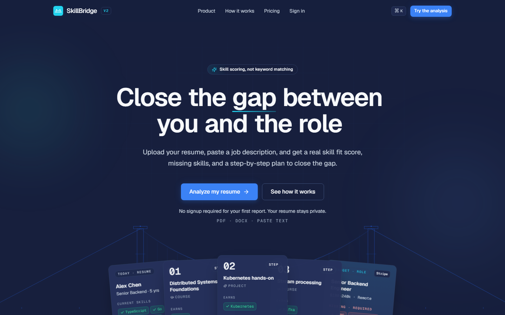
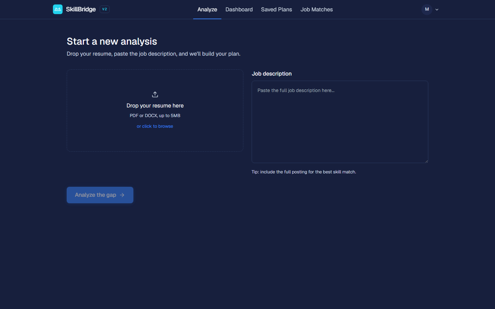
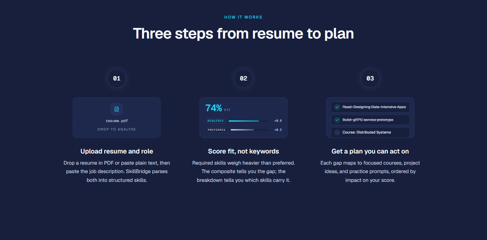

# 🌉 SkillBridge 2.0

<div align="center">

**Your AI-Powered Career Companion — from résumé to a concrete, buildable plan**

[](https://nextjs.org/)
[](https://react.dev/)
[](https://www.typescriptlang.org/)
[](https://tailwindcss.com/)

[](https://www.python.org/)
[](https://fastapi.tiangolo.com/)
[](https://github.com/pgvector/pgvector)
[](https://redis.io/)
[](https://openai.com/)

<br/>

### 🔗 [**Live Demo → skillbridge.cv**](https://skillbridge.cv/)



</div>

---

## 📋 Table of Contents

- [Overview](#overview)
- [Screenshots](#screenshots)
- [Features](#features)
- [Tech Stack](#tech-stack)
- [System Architecture](#system-architecture)
- [Getting Started](#getting-started)
- [Configuration](#configuration)
- [API Reference](#api-reference)
- [Project Structure](#project-structure)
- [Deployment](#deployment)
- [Authors](#authors)

---

## 🎯 Overview <a id="overview"></a>

**SkillBridge 2.0** is an AI-powered career platform that turns a résumé and a
target job description into a concrete plan to close the gap. It identifies the
skills you're missing, retrieves the courses that teach them using semantic
(RAG) search, and generates two portfolio projects that *prove* those skills to
recruiters. Separately, it surfaces live job postings ranked by how well they
match your skill set.

This is a full rewrite of the original project: a **Next.js** front end and a
**FastAPI + async worker** back end, backed by **Postgres/pgvector**, **Redis**,
and object storage — designed around two cleanly separated pipelines.

### Key Objectives

- **Skill Gap Analysis** — extract and compare skills from résumé vs. job description
- **RAG Course Recommendations** — semantic retrieval over an embedded course corpus
- **Portfolio Project Generation** — two LLM-generated projects that build the missing skills
- **Live Job Matching** — real job postings ranked per user by skill overlap
- **One Source of Truth** — every skill is normalized through a single canonical taxonomy

> **Try it live:** [**skillbridge.cv**](https://skillbridge.cv/) — no signup required for your first report.

---

## 📸 Screenshots <a id="screenshots"></a>

<div align="center">

**Skill Gap Analyzer** — upload a résumé, paste a job description, and get a real fit score.



<br/><br/>

**How it works** — three steps from résumé to a concrete, buildable plan.



</div>

---

## ✨ Features <a id="features"></a>

### 🔍 Skill Gap Analyzer

- **LLM Skill Extraction** — pulls skills from both the résumé (PDF/DOCX) and the job description
- **Canonical Matching** — every skill is normalized through one taxonomy (`data/taxonomy/skills.json`), so "JS", "JavaScript", and "ECMAScript" collapse to one skill
- **Weighted Scoring** — required vs. preferred coverage with an overall match score
- **Skill Categorization** — languages, frameworks/libraries, tools/platforms, and concepts

### 📚 RAG Course Recommendations

- **Semantic Retrieval** — a course corpus embedded with `text-embedding-3-small` and searched via **pgvector** cosine similarity
- **Priority-Weighted Ranking** — courses are ranked by how directly they cover your *missing* skills
- **Top-2 Selection** — a focused, actionable shortlist instead of an overwhelming list

### 🛠️ Portfolio Project Generation

- **Two LLM-Generated Projects** — each designed to demonstrate the skills you're missing
- **Buildable Detail** — tech stack, key features, and a phased implementation outline
- **Saved Plans** — every analysis is persisted and revisitable from your dashboard

### 💼 Live Job Matching

- **Greenhouse Job Boards** — refreshed automatically every 6 hours by a background worker
- **Per-User Ranking** — postings ordered by skill overlap with your profile
- **Recency Filtering** — stale postings are purged so the feed stays current

### 🔐 Auth & Platform

- **Google OAuth** — passwordless sign-in, server-side sessions in Redis
- **Guest Runs** — try an analysis before signing in, with IP-based rate limiting
- **Async Processing** — long analyses run on an **Arq** worker; the UI polls run status
- **Observability** — Sentry error tracking and Logfire structured tracing built in

---

## 🛠️ Tech Stack <a id="tech-stack"></a>

### Frontend

- **Next.js 14** (App Router) — marketing, auth, and app routes
- **React 18** + **TypeScript** — typed, component-driven UI
- **Tailwind CSS** — utility-first styling, custom responsive layouts
- **Motion** — animation; **lucide-react** — icons

### Backend

- **Python 3.12** + **FastAPI** — async API server
- **Arq** — Redis-backed task queue for the analysis jobs and the 6-hour jobs cron
- **SQLAlchemy 2.0 (async)** + **Alembic** — ORM and versioned migrations
- **Pydantic v2** / **pydantic-settings** — schemas and typed configuration
- **httpx** (HTTP/2) — Greenhouse API client

### AI & Data

- **OpenAI** — `text-embedding-3-small` (embeddings) + `gpt-4o` (project generation)
- **PostgreSQL + pgvector** — relational store *and* vector similarity search
- **Redis** — task queue, session store, guest-run state, rate-limit counters
- **Cloudflare R2** (S3-compatible, via **boto3**) — stores extracted résumé text
- **pypdf** + **python-docx** — résumé/document parsing

### Infrastructure

- **Docker** + **docker-compose** — local Postgres + Redis
- **Railway** — backend web + worker services; **Vercel** — frontend
- **GitHub Actions** — CI (lint, type-check, tests)

---

## 🏗️ System Architecture <a id="system-architecture"></a>

```
┌──────────────────────────────────────────────────────────────┐
│                     Frontend — Next.js 14                      │
│        Marketing · Auth (Google) · Dashboard · Analyze         │
└───────────────────────────────┬──────────────────────────────┘
                                 │  HTTPS (credentialed / CORS)
                                 ▼
┌──────────────────────────────────────────────────────────────┐
│                    FastAPI API  (web service)                  │
│   /auth  ·  /analyze  ·  /runs  ·  /dashboard  ·  /jobs        │
│   /plans ·  /me       ·  /healthz                              │
└───────┬───────────────────────────────────────┬──────────────┘
        │ enqueue job                            │ read/write
        ▼                                        ▼
┌───────────────────┐                  ┌──────────────────────┐
│   Arq Worker      │                  │  Postgres + pgvector │
│  Pipeline 1 (jobs)│◄────────────────►│  data + embeddings   │
│  Pipeline 2 (cron)│                  └──────────────────────┘
└───┬───────────┬───┘
    │           │
    ▼           ▼
┌─────────┐ ┌─────────┐   ┌───────────┐   ┌──────────────┐
│ OpenAI  │ │  Redis  │   │Cloudflare │   │  Greenhouse  │
│ LLM+emb │ │ queue   │   │ R2 (files)│   │  job boards  │
└─────────┘ └─────────┘   └───────────┘   └──────────────┘
```

### Data Flow — Analysis Pipeline

```
  Résumé (PDF/DOCX)        Job Description
        │                        │
        ▼                        ▼
   Extract & normalize skills (LLM → canonical taxonomy)
        │                        │
        └───────────┬────────────┘
                    ▼
            Skill diff + weighted match score
                    ▼
         RAG course retrieval (pgvector)  →  priority-weighted top-2
                    ▼
         LLM generates 2 portfolio projects (gpt-4o)
                    ▼
              Saved plan  →  Dashboard
```

1. **Input** — user uploads a résumé and pastes a job description
2. **Parse** — text extracted from PDF/DOCX and stored in R2
3. **Extract** — LLM pulls skills from both, normalized to the canonical taxonomy
4. **Diff & Score** — required/preferred coverage and an overall match score
5. **Retrieve** — missing skills drive a pgvector search over the course corpus
6. **Generate** — two portfolio projects are produced for the gap
7. **Persist** — the full plan is saved and shown on the dashboard

### Jobs Pipeline

A background cron refreshes Greenhouse boards every 6 hours, extracts and
normalizes each posting's skills, upserts them, purges stale rows, and serves a
per-user ranked feed at `/jobs`.

---

## 🚀 Getting Started <a id="getting-started"></a>

**Prerequisites:** [Docker](https://docs.docker.com/get-docker/),
[uv](https://docs.astral.sh/uv/), and [Node.js 18+](https://nodejs.org/).

### 1. Backend

```bash
cd backend
uv sync                                 # install Python deps into .venv
cp .env.example .env                    # fill in real values (see Configuration)
docker compose up -d                    # start Postgres + Redis locally
uv run alembic upgrade head             # apply database migrations
uv run uvicorn app.main:app --reload    # serve the API on http://localhost:8000
```

In a second terminal, start the worker (analysis jobs + the 6-hour jobs cron):

```bash
cd backend
uv run arq app.workers.settings.WorkerSettings
```

Health check: `curl http://localhost:8000/healthz` → `{"status":"ok"}`

### 2. Frontend

```bash
cd frontend
npm install
cp .env.local.example .env.local        # NEXT_PUBLIC_API_URL defaults to :8000
npm run dev                             # serve the app on http://localhost:3000
```

Open **http://localhost:3000**.

---

## ⚙️ Configuration <a id="configuration"></a>

Both apps are configured via env files — only the `.example` templates are
committed; real secrets never are.

- **`backend/.env`** — Postgres/Redis URLs, `OPENAI_API_KEY`, Cloudflare R2
  credentials, Google OAuth client ID/secret, `SESSION_SECRET`, and cookie/CORS
  settings. Every variable is documented inline in
  [`backend/.env.example`](backend/.env.example).
- **`frontend/.env.local`** — `NEXT_PUBLIC_API_URL`, the backend's base URL.

---

## 📚 API Reference <a id="api-reference"></a>

Interactive docs are auto-generated by FastAPI at **`/docs`** (Swagger UI) and
**`/redoc`** when the server is running.

| Method | Endpoint | Description |
| --- | --- | --- |
| `GET` | `/healthz` · `/readyz` | Liveness / readiness checks |
| `GET` | `/auth/google/login` | Start Google OAuth sign-in |
| `GET` | `/auth/google/callback` | OAuth callback |
| `POST` | `/auth/google/logout` | End the session |
| `GET` | `/me` | Current authenticated user |
| `POST` | `/analyze` | Submit a résumé + job description → enqueue an analysis run |
| `GET` | `/runs/{run_id}` | Poll the status/result of an analysis run |
| `GET` · `PATCH` | `/dashboard` | Read / update the user's dashboard profile |
| `GET` | `/plans` · `/plans/{plan_id}` | List / fetch saved plans |
| `GET` | `/jobs` | Per-user ranked job feed |

---

## 📁 Project Structure <a id="project-structure"></a>

```
SkillBridge-2.0/
├── backend/
│   ├── app/
│   │   ├── api/                 # FastAPI routers (analyze, auth, dashboard, jobs, plans, health)
│   │   ├── auth/                # Google OAuth + sessions
│   │   ├── pipeline_one/        # Analysis pipeline (ingest → extract → gap → retrieve → generate → persist)
│   │   ├── pipeline_two/        # Jobs pipeline (fetch → filter → extract → upsert → purge)
│   │   ├── rag/                 # Embedding + pgvector retrieval
│   │   ├── llm/                 # OpenAI clients (embeddings, gpt-4o)
│   │   ├── nlp/                 # Skill extraction + canonical normalization
│   │   ├── greenhouse/          # Greenhouse job-board client
│   │   ├── models/              # SQLAlchemy models
│   │   ├── schemas/             # Pydantic schemas
│   │   ├── workers/             # Arq worker + cron settings
│   │   ├── storage/             # Cloudflare R2 (boto3)
│   │   └── main.py              # App entrypoint
│   ├── alembic/                 # Database migrations
│   ├── data/taxonomy/           # Canonical skills.json (single source of truth)
│   ├── Dockerfile · docker-compose.yml
│   ├── railway.toml · railway.worker.toml
│   └── pyproject.toml
├── frontend/
│   └── app/                     # Next.js App Router: (marketing) · (auth) · (app)
├── skills_tax/                  # Skill taxonomy source data & tooling
└── JD-Resumes_examples/         # Sample job descriptions and résumés
```

---

## ☁️ Deployment <a id="deployment"></a>

- **Backend → Railway** — two services (`web` + `worker`) built from one
  `backend/Dockerfile`, plus managed Postgres (with `pgvector`), Redis, and a
  Cloudflare R2 bucket. Config-as-code lives in `backend/railway.toml` and
  `backend/railway.worker.toml`; the full env contract and go-live runbook are in
  `backend/docs/deploy.md`.
- **Frontend → Vercel** — set `NEXT_PUBLIC_API_URL` to the deployed backend URL.
  For cross-origin cookies, the backend needs `COOKIE_SECURE=true`,
  `COOKIE_SAMESITE=none`, and `FRONTEND_ORIGIN` set to the Vercel URL.

> **Note:** deploying the repo builds the app, but a running instance also needs
> its secrets set in the platform dashboards and Postgres/Redis/R2 provisioned —
> see `backend/docs/deploy.md`.

---

## 👥 Authors <a id="authors"></a>

- **Ahmed Ali** — [GitHub](https://github.com/AhmedKamal-41)
- **Surjo Barua** — [GitHub](https://github.com/Surfs101)
- **Jiayu Ouyang** — [GitHub](https://github.com/3ouyang3)
- **Ibnan Hasan**

---

<div align="center">

**Made with ❤️ for students and job seekers**

[🔗 Live Demo](https://skillbridge.cv/) · [⭐ Star this repo](https://github.com/Surfs101/level-up-llm-skill-analyzer)

</div>
