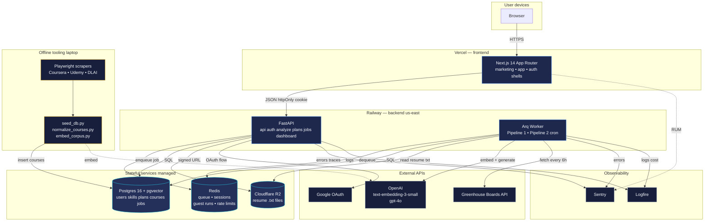

# SkillBridge — Backend System Design

**Version:** 1.1
**Audience:** Solo builder, ~5,000 lifetime users, US/Canada only
**Status:** Architecture locked, taxonomy real, ready to build

> **Changes since v1.0** — Taxonomy is no longer hypothetical: a real ~800-entry seed exists and drives the model. Eight skill categories (not four), each mapped to a `priority_rank`. New `technique` category added (RAG, ML, TDD, etc.). Taxonomy format is **JSON, not YAML**. Every skill now carries a stable slug `id` (the foreign-key anchor). Build discipline formalized: integrity-test-first (TDD) on the taxonomy, scope-limited phase prompts, read-only checkpoints between phases.

---

## 1. Headline

A FastAPI service on Railway with one async worker, one Postgres (with `pgvector`), one Redis, and one R2 bucket — wrapping two cleanly separated pipelines:

1. **Pipeline 1 — Analysis.** Resume + JD → canonical skill diff → RAG-retrieved courses → priority-weighted top-2 selection → two LLM-generated portfolio projects → saved plan.
2. **Pipeline 2 — Jobs.** Greenhouse boards refreshed every 6 hours → skills extracted with the same matcher used by Pipeline 1 → ranked per-user on demand by skill overlap.

**The single invariant the whole system rides on:** every skill enters via the canonical-skill matcher. There is exactly one place skills are extracted from text (`app/nlp/matcher.py`), and exactly one source of truth for what a skill *is* (`data/taxonomy/skills.json`). Every skill carries a stable slug `id` (e.g., `fastapi`, `node-js`, `machine-learning`) that is the foreign key everywhere downstream. No skill exists in two forms anywhere, and no surface string is ever stored where an `id` belongs.

**This is a deliberately small architecture.** Five thousand users at three lifetime analyses each is ~15K total runs. One FastAPI replica handles this with room to spare. There are no microservices, no Kubernetes, no read replicas, no separate vector DB, no global edge. Anything more would be over-engineering.

---

## 2. Requirements

### Functional

| # | Requirement |
|---|---|
| F1 | Signed-in users upload a resume (PDF/DOCX) + paste a JD, receive an analysis plan with matched/missing skills, a fit score, two recommended courses, and two LLM-generated projects. |
| F2 | Plans are immutable snapshots; saved forever for signed-in users. |
| F3 | Guests can run analysis 5×/24h per IP; result lives only in their tab session and is lost on close unless they sign up. |
| F4 | Signed-in users have an editable canonical skill set on `/dashboard`. Edits are partitioned into `extracted` (from resume) and `manual` (added/kept by the user). |
| F5 | Re-uploading a resume *merges* — replaces the `extracted` partition, preserves `manual`. |
| F6 | `/jobs` returns Greenhouse postings ≤ 21 days old, ranked by skill overlap with the user's current skill set. |
| F7 | Google OAuth is the only sign-in. No passwords. |

### Non-functional (SLOs)

| Metric | Target | Why |
|---|---|---|
| Pipeline 1 p95 end-to-end latency | < 35 s | Step 7 (two parallel `gpt-4o` calls) is the bottleneck at ~12–18 s; everything else sub-second. |
| API endpoint p95 latency (non-pipeline) | < 200 ms | Pagination, dashboard, jobs ranking all hit Postgres directly. |
| Availability | 99.5% (~3.6 h/month) | Solo project, no on-call. Higher targets aren't worth the cost. |
| Job posting freshness | ≤ 6 h stale | Cron cadence; acceptable since postings live 21 days. |
| Cold-start to first interactive | < 2 s | Frontend on Vercel CDN. |
| OpenAI cost per analysis | < $0.10 | Budget ceiling. Default config hits ~$0.07. |

---

## 3. Capacity (back of the envelope)

| Quantity | Estimate |
|---|---|
| Lifetime users | 5,000 |
| Analyses/user lifetime | ~3 |
| Total lifetime analyses | ~15,000 |
| Peak analyses/day | ~50 (worst-case viral hour: ~10) |
| Saved plans at steady state | ~12,000 |
| Resume file size | ≤ 5 MB |
| Resume `.txt` after extraction | ~10 KB |
| JD text | 0.5–10 KB |
| Skill taxonomy | ~900 canonical (after merges + technique additions) × ~12 aliases ≈ 10,000–15,000 patterns |
| Course catalogue | 5,000 courses |
| Course embeddings (1536 × 4B × 5K) | ~30 MB |
| Active Greenhouse postings | ~200 boards × ~50 jobs ≈ 10,000 |
| Postgres total size | < 2 GB |
| Redis working set | < 100 MB |
| R2 storage | < 200 MB (text only) |

**The constraint that actually matters** is OpenAI rate limits, not your infrastructure. Tier-1 OpenAI lets you run ~500 requests/minute on GPT-4o — your peak hour requires ~10. You will not be rate-limited.

---

## 4. Tech stack — the picks

Every choice is the simplest thing that's also right for this scale and shape. The "obvious modern default" — picked because it's the obvious modern default.

### Backend

| Layer | Pick | Why |
|---|---|---|
| Language | Python 3.12 | NLP, embeddings, OpenAI SDK, scrapers all best-in-class in Python. |
| API framework | **FastAPI** | Async-native, Pydantic validation, OpenAPI for free. |
| ASGI server | **Uvicorn** (via gunicorn in prod) | Standard. |
| ORM | **SQLAlchemy 2.0 (async)** | Modern async API; mature; works perfectly with `pgvector`. |
| DB driver | **asyncpg** | Fastest Postgres driver for Python. |
| Migrations | **Alembic** | Standard. |
| Data validation | **Pydantic v2** | Already comes with FastAPI; 5× faster than v1. |
| Task queue | **Arq** | Asyncio-native (RQ is sync). Pipeline 1 step 7 needs `asyncio.gather` for parallel OpenAI calls — Arq makes this natural. Runs on Redis, same infra as RQ. |
| HTTP client | **httpx (async)** | Async, supports HTTP/2, used for Greenhouse + as the OpenAI SDK's transport. |
| Retry / backoff | **tenacity** | Decorator-based; clean. |
| OAuth | **Authlib** | Battle-tested OAuth/OIDC. |
| Skill matcher | **FlashText** | ~30× faster than spaCy `PhraseMatcher` for pure literal matching against a dictionary. Word-boundary aware. Case-insensitive. Perfect fit. |
| Templating (prompts) | **Jinja2** | Standard. Prompts live as `.j2` files in repo, versioned in git. |

### Data layer

| Layer | Pick | Why |
|---|---|---|
| Primary DB | **Postgres 16** (Railway-managed) | Relational + JSONB + `pgvector` in one engine. No separate vector store needed at 5K vectors. |
| Vector search | **pgvector with HNSW index** | Sub-50ms similarity over 5K vectors. Zero new infrastructure. |
| Cache / queue / sessions / rate limits | **Redis** (Railway-managed) | One Redis serves four jobs: Arq queue, OAuth sessions, guest run state with TTL, rate limit counters. |
| Object storage | **Cloudflare R2** | Free egress, S3-compatible. Holds resume `.txt` files. |

### LLM / AI

| Layer | Pick | Why |
|---|---|---|
| Embeddings | **OpenAI `text-embedding-3-small`** (1536-dim) | Cheap, fast, strong retrieval quality. Larger isn't worth it at 5K corpus. |
| Project generation | **OpenAI `gpt-4o`** | Per your default. Two parallel calls per analysis. |
| Prompt management | Versioned `.j2` files in repo | A prompt change is a PR. No prompt CMS needed at this scale. |
| Evals | **promptfoo** (later, optional) | Build evals once you have real users — not before. |

### Auth, security, observability

| Layer | Pick | Why |
|---|---|---|
| Identity | **Google OAuth via Authlib** | Per your decision. No password handling. |
| Sessions | Server-side, Redis-backed, `httpOnly` cookies | Standard for web. No JWTs, no `localStorage`. |
| Secrets | **Railway environment variables** + git pre-commit hook blocking `.env` commits | Railway has built-in secrets. No need for Vault at this scale. |
| Error tracking | **Sentry** (free tier) | FastAPI middleware, Arq integration, frontend RUM in one place. |
| Structured logs / traces | **Logfire** (Pydantic) | FastAPI-native, OpenTelemetry under the hood, SQL-queryable. Free tier sufficient. |
| Rate limiting | Redis token bucket via **slowapi** | Simple, in-process. |
| Bot defense on signup | Not needed — Google handles | Free abuse protection. |

### Frontend (already in place)

Next.js 14 on Vercel — no changes needed. Backend exposes a clean REST API consumed by the existing components.

### Tooling

| Tool | Use |
|---|---|
| **uv** | Package manager — 10× faster than pip. |
| **ruff** | Linter + formatter (replaces black + flake8 + isort + pyupgrade). |
| **mypy** | Static type-checking. |
| **pytest + pytest-asyncio + httpx.AsyncClient** | Unit + integration tests. |
| **pre-commit** | Git hooks for ruff + mypy. |
| **GitHub Actions** | CI: lint → type-check → test on every PR. |
| **Playwright** (offline only, in `scrapers/`) | Course scraping. |

---

## 5. Architecture overview

One FastAPI process serves all HTTP. One Arq worker process runs both pipelines off the same Redis queue. Both processes share the same Python codebase, same Docker image, same Railway deployment — just different start commands. A scheduled job (Arq's cron feature) fires Pipeline 2 every 6 hours.

Frontend (Vercel, already built) → FastAPI (Railway) → Postgres + Redis + R2 → OpenAI / Google / Greenhouse externally.

The whole system is **stateless at the app tier** — every replica is interchangeable, sessions and rate limits live in Redis, files in R2. Horizontal scaling is `railway scale --replicas=N`, no other change. (You won't need it.)

---

## 6. Data model

```sql
-- Users
users (
  id UUID PRIMARY KEY,
  google_sub TEXT UNIQUE NOT NULL,
  email TEXT NOT NULL,
  name TEXT,
  avatar_url TEXT,
  created_at TIMESTAMPTZ DEFAULT NOW(),
  deleted_at TIMESTAMPTZ NULL  -- soft delete for right-to-delete
)

-- Canonical skill taxonomy (mirrored from data/taxonomy/skills.json at boot via sync command)
skills (
  id TEXT PRIMARY KEY,              -- slug, e.g. 'python', 'fastapi', 'node-js', 'machine-learning'
  display_name TEXT NOT NULL,       -- canonical_name, e.g. 'FastAPI'
  category TEXT NOT NULL,           -- one of 8: language|framework|library|database|cloud|devops|tool|technique
  priority_rank SMALLINT NOT NULL   -- 1=language, 2=framework, 3=library/database/cloud/devops/tool, 4=technique
)

-- All aliases that map to a canonical id; loaded into FlashText at boot
skill_aliases (
  alias TEXT PRIMARY KEY,           -- lowercased
  skill_id TEXT REFERENCES skills(id) ON DELETE CASCADE
)

-- User skill set — the dashboard's source of truth
user_skills (
  user_id UUID REFERENCES users(id) ON DELETE CASCADE,
  skill_id TEXT REFERENCES skills(id),
  source TEXT NOT NULL,             -- 'extracted' | 'manual'
  added_at TIMESTAMPTZ DEFAULT NOW(),
  PRIMARY KEY (user_id, skill_id)
)
-- Merge rule: on resume re-upload, DELETE WHERE source='extracted', then INSERT new.

-- Resume artifacts (only the .txt is kept)
resumes (
  id UUID PRIMARY KEY,
  user_id UUID REFERENCES users(id) ON DELETE CASCADE,
  r2_key_text TEXT NOT NULL,
  file_hash TEXT NOT NULL,          -- sha256 of original; dedupe support
  created_at TIMESTAMPTZ DEFAULT NOW()
)

-- Pipeline 1 runs (signed-in only; guests live in Redis)
runs (
  id UUID PRIMARY KEY,
  user_id UUID REFERENCES users(id) ON DELETE CASCADE,
  resume_id UUID REFERENCES resumes(id),
  status TEXT NOT NULL,             -- 'queued' | 'running' | 'completed' | 'failed'
  current_stage SMALLINT,           -- 1..8 for the progress UI
  error_message TEXT,
  started_at TIMESTAMPTZ DEFAULT NOW(),
  completed_at TIMESTAMPTZ
)

-- Immutable plan snapshots
plans (
  id UUID PRIMARY KEY,
  user_id UUID REFERENCES users(id) ON DELETE CASCADE,
  run_id UUID REFERENCES runs(id),
  jd_text TEXT NOT NULL,
  resume_text_snapshot TEXT NOT NULL,
  matched_skill_ids JSONB NOT NULL,     -- array of skill ids
  missing_skill_ids JSONB NOT NULL,     -- array, priority-sorted
  fit_score SMALLINT NOT NULL,          -- 0..100
  course_a_id UUID REFERENCES courses(id),
  course_b_id UUID REFERENCES courses(id),
  course_a_covered JSONB NOT NULL,
  course_b_covered JSONB NOT NULL,
  project_one_md TEXT NOT NULL,
  project_two_md TEXT NOT NULL,
  created_at TIMESTAMPTZ DEFAULT NOW()
)
CREATE INDEX idx_plans_user_created ON plans(user_id, created_at DESC);

-- Course catalogue
courses (
  id UUID PRIMARY KEY,
  platform TEXT NOT NULL,           -- 'coursera' | 'udemy' | 'deeplearning_ai'
  external_id TEXT NOT NULL,
  title TEXT NOT NULL,
  description TEXT,
  url TEXT NOT NULL,
  duration_hours NUMERIC,
  level TEXT,                       -- 'beginner' | 'intermediate' | 'advanced'
  scraped_at TIMESTAMPTZ DEFAULT NOW(),
  UNIQUE (platform, external_id)
)

course_skills (
  course_id UUID REFERENCES courses(id) ON DELETE CASCADE,
  skill_id TEXT REFERENCES skills(id),
  PRIMARY KEY (course_id, skill_id)
)
CREATE INDEX idx_course_skills_skill ON course_skills(skill_id);

course_embeddings (
  course_id UUID PRIMARY KEY REFERENCES courses(id) ON DELETE CASCADE,
  embedding vector(1536) NOT NULL,
  embedded_at TIMESTAMPTZ DEFAULT NOW()
)
CREATE INDEX idx_course_embeddings_hnsw
  ON course_embeddings USING hnsw (embedding vector_cosine_ops);

-- Greenhouse postings
job_postings (
  id UUID PRIMARY KEY,
  company TEXT NOT NULL,
  gh_job_id TEXT NOT NULL,
  title TEXT NOT NULL,
  location TEXT,
  url TEXT NOT NULL,
  jd_text TEXT NOT NULL,
  posted_at TIMESTAMPTZ NOT NULL,
  ingested_at TIMESTAMPTZ DEFAULT NOW(),
  UNIQUE (company, gh_job_id)
)
CREATE INDEX idx_jobs_posted_at ON job_postings(posted_at DESC);

job_skills (
  job_id UUID REFERENCES job_postings(id) ON DELETE CASCADE,
  skill_id TEXT REFERENCES skills(id),
  PRIMARY KEY (job_id, skill_id)
)
CREATE INDEX idx_job_skills_skill ON job_skills(skill_id);
```

Three things to call out:

1. **`plans` is a denormalized snapshot.** Skill IDs, JD text, resume text, project Markdown — all copied in. Editing skills later cannot mutate a saved plan.
2. **`user_skills.source`** is what makes the merge rule trivial: one `DELETE WHERE source='extracted'` + bulk insert.
3. **HNSW on `course_embeddings`** keeps RAG retrieval well under 50ms at the target scale.

---

## 6a. The taxonomy (the load-bearing layer)

The entire system's correctness rests on `data/taxonomy/skills.json`. Because skill extraction is rule-based (FlashText, no LLM, no fuzzy matching), a skill the taxonomy doesn't know is a skill the system is blind to. This is the deliberate trade-off: total determinism and zero per-analysis cost, paid for with up-front and ongoing taxonomy curation.

### Format and shape

Each entry is a JSON object:

```json
{
  "id": "fastapi",
  "canonical_name": "FastAPI",
  "category": "framework",
  "priority_rank": 2,
  "aliases": ["fast api", "fast-api"],
  "is_bundle": false,
  "bundle_expands_to": null
}
```

- **`id`** — stable slug, lowercase, `[a-z0-9]` plus `-`/`_`. This is the foreign key used in `skills.id`, `user_skills.skill_id`, `course_skills.skill_id`, `job_skills.skill_id`, and inside every `plans` JSONB array. Slugs are derived deterministically from `canonical_name` (`C++` → `cpp`, `Node.js` → `node-js`, `shadcn/ui` → `shadcn-ui`) and never change once assigned.
- **`canonical_name`** — the single human-readable display form. What the UI renders.
- **`category`** — one of eight (below).
- **`priority_rank`** — denormalized from category for fast sorting.
- **`aliases`** — every lowercased surface form that should resolve to this id. Globally unique; an alias may never collide with any canonical name or any other alias.
- **`is_bundle` / `bundle_expands_to`** — scaffolded but **unused in v1**. Reserved for future expansion of meta-skills like "MERN stack" → [mongodb, express, react, node-js].

### The eight categories and priority scheme

`data/taxonomy/categories.json` is the source of truth for ranks. Missing skills in a gap are sorted by `priority_rank` ascending — languages first (you can't use a framework without its language), techniques last.

| Category | `priority_rank` | Examples |
|---|---|---|
| `language` | 1 | Python, TypeScript, Go, C, R |
| `framework` | 2 | FastAPI, Next.js, Django, React, Spring Boot |
| `library` | 3 | Pandas, React Query, shadcn/ui, NumPy |
| `database` | 3 | PostgreSQL, Redis, Snowflake, MongoDB |
| `cloud` | 3 | AWS S3, Vercel, GCP Pub/Sub, Railway |
| `devops` | 3 | Docker, Terraform, GitHub Actions, Kubernetes |
| `tool` | 3 | VS Code, Figma, Postman, Jupyter |
| `technique` | 4 | RAG, Machine Learning, TDD, Microservices, ETL |

The five "mid-tier" categories (`library`/`database`/`cloud`/`devops`/`tool`) share rank 3 because there's no meaningful learn-order between, say, Docker and Postgres — they're situational. The course-selection weight map (section 8, step 6) collapses these to the same tier intentionally.

### Why `technique` matters

The original seed had no concept category — RAG was filed under `tool`, and Machine Learning, NLP, TDD, Microservices, CI/CD (the practice), ETL, etc. simply didn't exist. These are exactly the high-signal phrases JDs use to filter candidates ("5+ years of machine learning," "experience with microservices and event-driven architecture"). Phase 0 adds ~75 technique entries. They rank last in priority because they're learned *through* concrete languages/frameworks, not before them — but they're heavily weighted in course matching because covering a technique gap (e.g., "learn RAG") is often the headline value a course provides.

### Maintenance contract

The taxonomy is never "done." Two mechanisms keep it healthy:

1. **`scripts/build_taxonomy.py`** — idempotent transform from `skills_raw.json` → `skills.json`. Generates slugs, injects ranks, de-conflicts aliases, adds techniques. Re-runnable; produces byte-identical output on repeat runs.
2. **`app/nlp/audit.py`** — read-only CLI run monthly over recent resumes/JDs. Surfaces high-frequency unmatched tokens that look skill-shaped (CamelCase, dotted, all-caps) as candidate gaps. Never mutates the taxonomy; a human reviews and adds.

Every change to the taxonomy is logged in `data/taxonomy/CHANGELOG.md`. The whole thing is guarded by `tests/test_taxonomy_integrity.py` — 11 assertions (unique ids, slug format, unique canonicals, valid categories, rank consistency, globally-unique aliases, no alias/canonical collisions, no self-references) that must pass before any code depends on the data.

---

## 7. Directory layout

```
backend/
├── pyproject.toml
├── ruff.toml
├── railway.toml
├── alembic.ini
├── alembic/versions/
│
├── data/
│   ├── taxonomy/
│   │   ├── skills_raw.json     # pristine original seed — never edited by hand
│   │   ├── skills.json         # cleaned canonical skills — single source of truth
│   │   ├── categories.json     # 8 categories → priority_rank
│   │   └── CHANGELOG.md        # audit trail of every taxonomy change
│   └── companies.json          # ~200 Greenhouse company slugs
│
├── scripts/
│   ├── build_taxonomy.py       # idempotent: skills_raw.json → skills.json
│   ├── generate_aliases.py     # batch LLM alias generation
│   └── sync_taxonomy_to_db.py  # load skills.json → Postgres skills/skill_aliases
│
├── app/
│   ├── main.py                  # FastAPI app factory, router mounts, middleware
│   ├── config.py                # pydantic-settings
│   ├── deps.py                  # get_db, get_current_user, get_session
│   │
│   ├── api/                     # HTTP routes only — no business logic
│   │   ├── auth.py              # /auth/google/{login,callback,logout}, /me
│   │   ├── analyze.py           # POST /analyze, GET /runs/{id}
│   │   ├── plans.py             # GET /plans, /plans/{id}, DELETE /plans/{id}
│   │   ├── jobs.py              # GET /jobs
│   │   └── dashboard.py         # GET/PATCH /dashboard
│   │
│   ├── schemas/                 # Pydantic request/response DTOs
│   │   ├── auth.py
│   │   ├── analyze.py
│   │   ├── plans.py
│   │   ├── jobs.py
│   │   └── dashboard.py
│   │
│   ├── models/                  # SQLAlchemy 2.0 ORM
│   │   ├── base.py
│   │   ├── user.py
│   │   ├── skill.py
│   │   ├── resume.py
│   │   ├── run.py
│   │   ├── plan.py
│   │   ├── course.py
│   │   └── job_posting.py
│   │
│   ├── pipeline_one/            # ★ ANALYSIS — one DIRECTORY per step
│   │   ├── __init__.py          # orchestrator: imports each step's run(), chains them
│   │   ├── state.py             # PipelineState — the typed object threaded through all steps
│   │   ├── 01_ingest/
│   │   │   ├── __init__.py      # exports run(state) -> state
│   │   │   ├── logic.py         # validate upload, hash, stage to R2
│   │   │   ├── schemas.py       # this step's in/out Pydantic models
│   │   │   └── README.md        # purpose, inputs, outputs, failure modes
│   │   ├── 02_extract_text/
│   │   │   ├── __init__.py
│   │   │   ├── logic.py         # PDF/DOCX → .txt, persist to R2, drop binary
│   │   │   ├── schemas.py
│   │   │   └── README.md
│   │   ├── 03_extract_skills/
│   │   │   ├── __init__.py
│   │   │   ├── logic.py         # delegates to app/nlp/matcher.py for both texts
│   │   │   ├── schemas.py
│   │   │   └── README.md
│   │   ├── 04_gap_analysis/
│   │   │   ├── __init__.py
│   │   │   ├── logic.py         # matched/missing sets, priority sort, fit_score
│   │   │   ├── schemas.py
│   │   │   └── README.md
│   │   ├── 05_retrieve_courses/
│   │   │   ├── __init__.py
│   │   │   ├── logic.py         # embed gap, pgvector top-50 (uses app/rag/retriever)
│   │   │   ├── schemas.py
│   │   │   └── README.md
│   │   ├── 06_select_courses/
│   │   │   ├── __init__.py
│   │   │   ├── logic.py         # priority-weighted coverage rank → Course A, Course B
│   │   │   ├── schemas.py
│   │   │   └── README.md
│   │   ├── 07_generate_projects/
│   │   │   ├── __init__.py
│   │   │   ├── logic.py         # two parallel gpt-4o calls via asyncio.gather
│   │   │   ├── schemas.py
│   │   │   ├── README.md
│   │   │   └── prompts/
│   │   │       ├── project_fast_apply.j2
│   │   │       └── project_skillbridge.j2
│   │   └── 08_persist/
│   │       ├── __init__.py
│   │       ├── logic.py         # write Plan row (users) or Redis record (guests)
│   │       ├── schemas.py
│   │       └── README.md
│   │
│   ├── pipeline_two/            # ★ JOBS — one DIRECTORY per step
│   │   ├── __init__.py          # cron entry: chains steps, runs every 6h
│   │   ├── state.py             # JobsRefreshState threaded through the steps
│   │   ├── 01_fetch_boards/
│   │   │   ├── __init__.py
│   │   │   ├── logic.py         # async Greenhouse fetch per company
│   │   │   ├── schemas.py
│   │   │   └── README.md
│   │   ├── 02_filter_recent/
│   │   │   ├── __init__.py
│   │   │   ├── logic.py         # ≤21 days + US/Canada location filter
│   │   │   ├── schemas.py
│   │   │   └── README.md
│   │   ├── 03_extract_skills/
│   │   │   ├── __init__.py
│   │   │   ├── logic.py         # SAME app/nlp/matcher.py as pipeline_one
│   │   │   ├── schemas.py
│   │   │   └── README.md
│   │   ├── 04_upsert/
│   │   │   ├── __init__.py
│   │   │   ├── logic.py         # upsert job_postings + replace job_skills
│   │   │   ├── schemas.py
│   │   │   └── README.md
│   │   └── 05_purge_old/
│   │       ├── __init__.py
│   │       ├── logic.py         # delete postings older than 21 days
│   │       ├── schemas.py
│   │       └── README.md
│   │
│   ├── nlp/
│   │   ├── matcher.py           # FlashText KeywordProcessor (singleton)
│   │   ├── taxonomy.py          # loads skills.json + categories.json on boot
│   │   ├── audit.py             # CLI: scan runs for unmatched tokens → taxonomy gaps
│   │   └── text_clean.py
│   │
│   ├── llm/
│   │   ├── client.py            # async OpenAI client with retries + cost ledger
│   │   ├── embeddings.py
│   │   └── prompts/             # shared/cross-step prompts only;
│   │       └── .gitkeep         # step-specific prompts live inside the step dir (e.g. 07_generate_projects/prompts/)
│   │
│   ├── rag/
│   │   ├── retriever.py         # gap text → embedding → top-50 candidates
│   │   └── ranker.py            # priority-weighted coverage score
│   │
│   ├── auth/
│   │   ├── google.py            # Authlib OAuth flow
│   │   └── sessions.py          # Redis-backed httpOnly cookie sessions
│   │
│   ├── storage/r2.py
│   ├── greenhouse/client.py
│   ├── workers/
│   │   ├── settings.py          # Arq worker config + cron registrations
│   │   └── tasks.py             # run_pipeline_one, refresh_jobs, refresh_courses
│   │
│   └── common/
│       ├── errors.py            # exception → HTTP mapping
│       ├── logging.py           # Logfire setup
│       ├── rate_limit.py
│       └── ids.py
│
├── scrapers/                    # ★ Offline tooling — separate process boundary
│   ├── README.md
│   ├── coursera.py
│   ├── udemy.py
│   ├── deeplearning_ai.py
│   ├── normalize_courses.py     # course title+desc → canonical skill IDs via LLM
│   └── seed_db.py               # load 5K courses + embed + insert
│
├── tests/
│   ├── unit/
│   │   ├── nlp/                 # matcher, taxonomy, audit
│   │   ├── pipeline_one/        # mirrors the step dirs — one test file per step
│   │   │   ├── test_01_ingest.py
│   │   │   ├── test_02_extract_text.py
│   │   │   ├── test_03_extract_skills.py
│   │   │   ├── test_04_gap_analysis.py
│   │   │   ├── test_05_retrieve_courses.py
│   │   │   ├── test_06_select_courses.py
│   │   │   ├── test_07_generate_projects.py
│   │   │   └── test_08_persist.py
│   │   └── pipeline_two/
│   │       ├── test_01_fetch_boards.py
│   │       ├── test_02_filter_recent.py
│   │       ├── test_03_extract_skills.py
│   │       ├── test_04_upsert.py
│   │       └── test_05_purge_old.py
│   ├── integration/
│   │   ├── test_pipeline_one_e2e.py   # full chain on a fixture resume+JD
│   │   └── test_pipeline_two_e2e.py
│   └── fixtures/
│       ├── resumes/             # sample PDFs/DOCXs + optional .expected.json
│       └── jds/                 # sample JDs + optional .expected.json
│
└── .github/workflows/ci.yml
```

`scrapers/` is **deliberately not** in `app/`. The live FastAPI/worker image does not ship Playwright + browser binaries. Scrapers run on your laptop or as Railway one-off jobs, write to the production DB, and the live service never imports `scrapers.*`.

### Step-module convention

Each pipeline step is a self-contained directory, not a single file. The contract:

- **`__init__.py`** exposes exactly one public callable, `async def run(state: PipelineState) -> PipelineState`. The orchestrator only ever calls `run()`; everything else in the directory is private to the step.
- **`logic.py`** holds the implementation. **`schemas.py`** holds the step's own Pydantic in/out models. **`prompts/`** appears only on steps that call an LLM (`07_generate_projects`). **`README.md`** documents purpose, inputs, outputs, and failure modes so a step is understandable in isolation.
- **State is threaded, not mutated globally.** A single `PipelineState` object (defined in `pipeline_one/state.py`) carries everything — resume text, JD text, extracted skill sets, the gap, retrieved courses, selected courses, generated projects. Each step reads what it needs and returns an updated copy. This makes every step independently testable with a hand-built `PipelineState` fixture.
- **Tests do not live beside the step.** They mirror the structure under `tests/unit/pipeline_one/test_0N_*.py`, keeping `app/` import-clean and all test discovery in one place.
- **Import note:** directory names begin with digits (`04_gap_analysis`) for natural ordering, which Python's `import` statement can't load directly. The orchestrator resolves steps with `importlib.import_module()` by string name, iterating the ordered step list. This keeps the on-disk order obvious while staying importable.

The orchestrator (`pipeline_one/__init__.py`) is therefore tiny: an ordered list of step module names, a loop that imports each, calls `run(state)`, and updates `runs.current_stage` between steps so the polling UI advances.

---

## 8. Pipeline 1 — Analysis, step by step

**Trigger.** `POST /analyze` with `multipart/form-data` (resume) + `jd_text`. Authenticated users get a `Run` row in Postgres; guests get a Redis-only record with 1-hour TTL. Either way, the response is immediate: `{ run_id }`. Frontend polls `GET /runs/{id}` and renders the existing 6-stage progress UI.

**Execution.** A single Arq task `run_pipeline_one(run_id)` chains each step's `run(state)` in sequence. Between steps it updates `runs.current_stage` (or the Redis record for guests). Each step is a pure function: `(input_state) → output_state`. This makes every step independently testable with a hand-built `PipelineState` fixture.

| Step | Module | What happens | Latency |
|---|---|---|---|
| 1 | `01_ingest/` | Validate file (≤5MB, pdf/docx), compute sha256, write binary to R2 staging key. | < 100 ms |
| 2 | `02_extract_text/` | `pypdf` or `python-docx` → normalize whitespace → write `.txt` to permanent R2 key → delete staging binary. | 300–800 ms |
| 3 | `03_extract_skills/` | FlashText `KeywordProcessor` (loaded once at process boot) extracts canonical skill IDs from both resume text and JD text. **Normalization is implicit** — the matcher returns canonical IDs directly. | < 50 ms |
| 4 | `04_gap_analysis/` | `matched = resume ∩ jd`, `missing = jd − resume`, sort `missing` by `priority_rank` ascending (rank 1 languages → rank 2 frameworks → rank 3 libraries/databases/cloud/devops/tools → rank 4 techniques). `fit_score = round(100 × |matched| / |jd|)`. | < 10 ms |
| 5 | `05_retrieve_courses/` | Build query string from missing skills' display names, embed via `text-embedding-3-small`, run `pgvector` cosine top-50 with HNSW index. | 200–400 ms |
| 6 | `06_select_courses/` | Score each of 50 candidates by priority-weighted coverage (see formula below). Pick rank 1 → Course A, rank 2 → Course B. Tie-break: raw coverage count, then shorter `duration_hours`. | < 10 ms |
| 7 | `07_generate_projects/` | **`asyncio.gather`** two `gpt-4o` calls in parallel. Prompts loaded from this step's own `prompts/*.j2`. | 10–18 s |
| 8 | `08_persist/` | Write `Plan` row (for users) or update Redis run record (for guests). Mark run completed. | < 50 ms |

**Course selection formula** (step 6):

```
# weight by priority_rank — covering a higher-priority gap is worth more
weight = {1: 4, 2: 3, 3: 2, 4: 1}   # rank 1 (language) … rank 4 (technique)
score(course) = Σ weight[priority_rank(s)] for s in missing_skills if s in course.skills
```

Note the deliberate asymmetry between *gap sorting* and *course scoring*. Missing skills are **displayed** to the user sorted by priority (languages first). But when scoring courses, a language gap is *worth the most points* (weight 4) because covering it is the biggest unblock. A technique gap is worth the least (weight 1) — not because techniques don't matter, but because a course covering only techniques without the underlying language is less actionable for someone who lacks the language. The two rank-3 tiers (libraries, databases, cloud, devops, tools) all score at weight 2.

This is the simple, deterministic ranking you asked for. No JD-bucket detour. No LLM in the loop. The highest-scoring course is "the top course"; its `covered ∩ missing` set is the skillset that feeds Project 2.

**Project prompts** (Jinja2, abbreviated — full versions live in `app/llm/prompts/`):

*`project_fast_apply.j2`:*
> You are a senior engineer designing a portfolio project for a candidate applying to this job.
>
> Candidate's current skills: `{{ matched_skill_names }}`
> Job description:
> ```
> {{ jd_text }}
> ```
> Design a portfolio project that uses ONLY the candidate's listed skills (do not introduce any skill not in the list). Mirror what the role actually does day-to-day, based on the JD. Senior-level idea, but implementable by a new grad in 1–2 weeks.
>
> Return Markdown with sections: Project Title, One-Line Pitch, Why This Fits the Role, Tech Stack, Phase 1, Phase 2, Phase 3, README Outline, How to Demo in an Interview.

*`project_skillbridge.j2`:* same as above, but candidate also has `{{ course_a_covered_names }}` from a course they're taking. Project must require BOTH sets, proving the course content was internalized.

**The "only listed skills" constraint is load-bearing** — it's what prevents the LLM from suggesting "use Kubernetes" when the resume has no DevOps skills.

---

## 9. Pipeline 2 — Jobs

A scheduled Arq cron fires `refresh_jobs()` every 6 hours.

| Step | Module | What happens |
|---|---|---|
| 1 | `01_fetch_boards/` | For each of ~200 companies, async `httpx.get('https://boards-api.greenhouse.io/v1/boards/{company}/jobs?content=true')` with 500ms spacing and 3-retry exponential backoff. |
| 2 | `02_filter_recent/` | Keep jobs with `updated_at` within last 21 days AND `location` matching US/Canada heuristics (regex on a curated list of state/province names + remote-US/CA flags). |
| 3 | `03_extract_skills/` | Strip HTML from job content, run through the **same** `matcher.py` Pipeline 1 uses. This is why both pipelines share `app/nlp/matcher.py` — symmetric extraction guarantees symmetric scoring. |
| 4 | `04_upsert/` | Upsert `job_postings` row; replace `job_skills`. |
| 5 | `05_purge_old/` | `DELETE FROM job_postings WHERE posted_at < NOW() - INTERVAL '21 days'`. |

**`GET /jobs` is then trivial:**

```sql
SELECT jp.*, COUNT(js.skill_id) FILTER (WHERE js.skill_id = ANY(:user_skill_ids)) AS overlap
FROM job_postings jp
LEFT JOIN job_skills js ON js.job_id = jp.id
WHERE jp.posted_at > NOW() - INTERVAL '21 days'
GROUP BY jp.id
ORDER BY overlap DESC, jp.posted_at DESC
LIMIT 30 OFFSET :offset
```

Sub-100ms even at 10K postings, thanks to the index on `job_skills.skill_id` and the bounded date window.

When the user edits `/dashboard`, nothing async fires — the next `/jobs` read sees the updated `user_skills` and re-ranks naturally.

---

## 10. Auth and guest mechanics

**Google OAuth flow:**

1. `GET /auth/google/login` → Authlib redirects to Google with PKCE.
2. Google → `GET /auth/google/callback?code=...&state=...`.
3. Server exchanges code, validates ID token signature against Google's JWKS, upserts user by `google_sub`.
4. Generate 32-byte random `session_id`; store `{session_id → user_id, expires_at}` in Redis with 7-day sliding TTL.
5. Set cookie: `Set-Cookie: sid=<session_id>; HttpOnly; Secure; SameSite=Lax; Max-Age=604800`.
6. Frontend redirects to `/analyze`.

**Logout** deletes the Redis key and clears the cookie.

**Guest flow:** `POST /analyze` without a session cookie. Server generates a `guest_run_id`, stores `{run_id → {state, jd_text, resume_text, ...}}` in Redis with 1-hour TTL. The frontend's `running/[id]` page polls; once complete, the plan is rendered. When the tab closes or the TTL expires, the data is gone forever.

**Guest rate limit:** Redis `INCR rl:guest:{sha256(client_ip + daily_salt)}` with 24-hour TTL. Sixth attempt returns `429 Too Many Requests`. IP is never stored in plaintext.

---

## 11. Security posture

| Surface | Mitigation |
|---|---|
| TLS | Railway terminates TLS 1.3 with auto-renewing certs. Cloudflare in front of Vercel. HSTS preload. |
| Session theft | `HttpOnly; Secure; SameSite=Lax` cookies. Redis revocation on logout / account deletion. No JWTs. |
| CSRF | SameSite=Lax + double-submit token for non-idempotent endpoints. |
| Injection | SQLAlchemy 2.0 parameterized everywhere. No raw SQL string concatenation. Pydantic v2 strict mode validates every request body. |
| SSRF | Greenhouse client uses a fixed company allowlist. R2 client allowlists its own bucket. No user-supplied URLs ever fetched server-side. |
| File upload abuse | Magic-byte check (`python-magic`) — reject anything not actually PDF/DOCX. 5MB size cap before reading body. |
| PII (resumes) | Raw PDF/DOCX deleted after step 2. `.txt` kept in R2 under random keys, fetched only via short-lived signed URLs. Postgres encrypted at rest by Railway. |
| OpenAI data | Resume + JD text transit OpenAI; this is unavoidable for the feature. OpenAI does not train on API data by default. Mentioned in privacy policy. |
| Right to delete | `DELETE /me` purges user, resumes from R2, plans, user_skills, runs, sessions — in one transaction (R2 deletes after DB commit). Soft delete first, hard purge job after 30 days. |
| Secrets | Railway env vars. Pre-commit hook blocks `.env` and known key patterns. |
| Dependencies | Dependabot weekly PRs. |
| Logs | Structured JSON to Logfire. Email and PII redacted before logging. |
| Rate limits | Per-IP on `/auth/*` and `/analyze` guest. Per-user on `/analyze` authenticated (20/day). |

---

## 12. Observability and SRE

| Pillar | Tool | What it covers |
|---|---|---|
| Errors + perf traces | **Sentry** | Backend exceptions, frontend errors, slow transactions. FastAPI + Arq integrations. Frontend Next.js SDK. |
| Structured logs | **Logfire** (Pydantic) | Every request, every step boundary, every external API call. Tags: `run_id`, `user_id`, `step`, `latency_ms`, `cost_usd`. |
| Uptime checks | **Better Stack** free | Synthetic GET / and /healthz every minute from 3 regions. |
| Cost ledger | Custom — Postgres `llm_calls` table | Per-run OpenAI cost, aggregated daily. Alert if any user exceeds $0.50/day. |

**SLIs to track from day one:**

- Pipeline 1 success rate (target ≥ 98%)
- Pipeline 1 p95 latency (target < 35s)
- API p95 latency by route
- Greenhouse refresh success rate (target ≥ 95%)
- OpenAI error rate (target < 1%)
- Daily OpenAI spend

**Healthcheck:** `GET /healthz` returns 200 if DB + Redis are reachable; `GET /readyz` additionally checks that the taxonomy is loaded and the OpenAI client can authenticate.

---

## 13. Delivery and CI/CD

**Trunk-based development.** Short-lived feature branches off `main`. Squash-merge.

**CI** (GitHub Actions, every PR):

1. `uv sync` (install deps)
2. `ruff check && ruff format --check`
3. `mypy app/`
4. `pytest -n auto` (unit + integration with Postgres + Redis services in the runner)

**CD** (Railway): auto-deploy on push to `main`. Two services from one repo:

- `web` — starts with `uvicorn app.main:app --host 0.0.0.0 --port $PORT`
- `worker` — starts with `arq app.workers.settings.WorkerSettings`

Database migrations run as a pre-deploy hook: `alembic upgrade head`.

**Migrations follow expand → migrate → contract** for zero downtime: add new columns nullable first, backfill in a separate deploy, then drop old columns in a third. At your scale you can usually skip this and accept a 30s migration pause — but the rule is good to follow when in doubt.

**Pre-commit hooks** (local): `ruff format`, `ruff check --fix`, `mypy --quiet`, and a secret scanner.

**Rollback:** Railway one-click redeploy of any previous build.

---

## 14. Cost model

| Line item | Monthly at steady state (~1,500 analyses/mo) | Notes |
|---|---|---|
| Railway: FastAPI service | ~$5 | Hobby plan, scales to enough for this load. |
| Railway: Arq worker | ~$5 | Same image, second service. |
| Railway: Postgres 1GB | ~$5 | Includes daily backups. |
| Railway: Redis 256MB | ~$3 | |
| Cloudflare R2 | ~$0.20 | < 200 MB total; egress free. |
| OpenAI: embeddings (analysis-time) | ~$0.30 | Negligible. |
| OpenAI: GPT-4o project gen | ~$95 | 1,500 runs × 2 calls × ~$0.03/call. **The dominant cost.** |
| Sentry / Logfire / Better Stack | $0 | All free tier. |
| Vercel (frontend) | $0 | Hobby. |
| Domain | ~$1 | |
| **Total** | **~$115/mo** | |

**Lifetime OpenAI spend** at 5K users × 3 runs = 15K runs × ~$0.07 = **~$1,050** total. Well under the $3K mental ceiling.

**Cost levers if needed:**
- Cache `(resume_hash, jd_hash) → plan` for 24h — saves on re-runs (e.g., user iterating on a JD).
- OpenAI prompt caching on the project prompt — automatic, saves ~50% on system-prompt tokens.
- Drop to `gpt-4o-mini` for Project 1 (the "fast apply" one), keep `gpt-4o` only for Project 2 (the more ambitious one). Cuts project costs ~60%.

---

## 15. Failure modes

| Failure | Mitigation |
|---|---|
| **PDF/DOCX won't parse** | Catch in step 2, mark run failed with friendly message ("we couldn't read this file — try re-saving as PDF"). Surface in the running UI. |
| **Zero skills extracted** from resume OR JD | Almost always a junk upload or a soft-skills-only JD. Fail the run with "we couldn't find technical skills — make sure the JD includes the actual tech stack." |
| **Fewer than 2 RAG candidates** | Vanishingly rare with 5K courses, but possible for niche stacks. Fall back to top-2 by overall coverage of the taxonomy categories present in the gap. |
| **OpenAI 5xx or 429** | Tenacity: 3 retries with exponential backoff (1s, 2s, 4s). After that, fail the run; user retries from the UI. Two parallel project calls are independent — one failing doesn't kill the other; we fail the run only if both fail. |
| **Worker crash mid-run** | Arq marks the job failed on reconnect. Run row goes to `failed`. UI surfaces "something went wrong — retry?". Acceptable at this scale; no Temporal-style durable workflow needed. |
| **Greenhouse rate-limit / 5xx** | Log, skip that company this cycle, retry next cycle. Existing data stays — staleness is bounded by the 21-day window. |
| **Postgres connection saturation** | SQLAlchemy async pool with `pool_size=10`, `max_overflow=20`. Pgbouncer not needed at this scale. |
| **Redis eviction** | All keys have explicit TTLs (sessions 7d, guest runs 1h, rate limits 24h). `maxmemory-policy: allkeys-lru` as a safety net. |
| **Taxonomy drift** | LLM suggests "FastAPI" when user wrote "Fast api" but `skills.json` is missing that alias. Mitigation: `python -m app.nlp.audit <dir>` CLI scans recent runs for high-frequency unmatched skill-shaped tokens, surfaces them as candidate gaps for human review. Run monthly; add accepted entries via `scripts/build_taxonomy.py` and log in CHANGELOG. |
| **Scraper breaks (HTML changes)** | Scrapers are offline. A broken scraper produces zero new courses; existing 5K stay in the DB. Detect via the monthly refresh job's success metric. |

---

## 16. Trade-offs — what we picked, what we didn't, why

| Decision | Picked | Rejected | Why |
|---|---|---|---|
| Skill extraction | Rule-based via FlashText against curated taxonomy | LLM extraction; hybrid LLM-then-normalize | Determinism, zero LLM cost per analysis, no hallucination risk. Trade-off: misses skills not in taxonomy → mitigated by the monthly audit CLI. |
| Vector store | pgvector | Pinecone, Qdrant, Weaviate | 5K vectors. One database, one operational surface. Move to dedicated only if/when 1M+ vectors. |
| Task queue | Arq | Celery, RQ, Temporal, Inngest | Asyncio-native (matches FastAPI), runs on Redis (no new infra), simple. Temporal would be over-engineering. |
| Worker durability | Best-effort (run fails, user retries) | Temporal / durable workflows | At ~50/day peak, a crash-then-retry UX is fine. Temporal's value emerges at 100s of concurrent workflows with human-in-the-loop. |
| Skill matcher implementation | FlashText | spaCy PhraseMatcher | ~30× faster on 15K patterns. We're not doing NLP, just literal phrase matching with word boundaries. |
| Embedding model | `text-embedding-3-small` (1536-dim) | `-large` (3072), Voyage, BGE | Strong retrieval at 5K corpus. Half the storage. Plenty good. |
| Job ingestion | 6-hour cron | Live per-request | Greenhouse rate limits, simplicity, predictable cost. Postings live 21 days so 6h stale is fine. |
| Project tailoring | JD-text-only prompt | Company-data lookup table | You explicitly chose simpler tailoring. Cheaper, fewer moving parts, prompt is the only thing to tune. |
| Plans | Immutable snapshots | Recomputed-on-render | History integrity; user trust in saved plans; no surprise mutations. |
| Auth | Google OAuth only | Email + password, multi-provider | Solo project, US/Canada, no enterprise. Adding more providers is one Authlib config line later. |
| Sessions | Server-side cookie via Redis | JWT | Easy revocation, no localStorage. |
| Single-region deployment | `us-east` | Multi-region | US/Canada users get < 100ms RTT. Multi-region triples cost and complexity. |
| Frontend → backend transport | REST + JSON | GraphQL, tRPC | Simple, OpenAPI-generated TS types possible, no client-state complexity. |
| Progress UI | Polling `/runs/{id}` every ~1s | SSE / WebSocket | 30-second pipeline; polling overhead negligible; one less thing to deploy. |

**Things we are explicitly NOT building (and shouldn't, at v1):**

- Microservices, Kubernetes, service mesh
- Read replicas, sharding, multi-region
- Separate vector database
- Email service (Google handles password reset; no notifications in v1)
- Payments (free tier only)
- Mobile app
- Fine-tuned models, evals platform, prompt CMS
- Admin dashboard (use Postgres directly via Railway's SQL UI)

---

## 17. Build order

Each phase is driven by a single scope-limited agent prompt and gated by a read-only checkpoint that runs lint + types + tests + the phase's done-criteria before the next phase begins. The taxonomy is built test-first: the integrity test exists before the data transform.

**Phase 0 — Setup + taxonomy cleanup (week 1). Load-bearing.**
Scaffold the repo (section 7). Preserve the raw seed as `skills_raw.json`. Write `tests/test_taxonomy_integrity.py` (11 assertions) *first*. Write `data/taxonomy/categories.json` (8 categories → rank). Write `scripts/build_taxonomy.py` to generate slug ids, inject ranks, normalize + de-conflict aliases, add the ~75 `technique` entries plus missing canonicals (`C`, `R`, `Octave`, `Pandoc`, `OpenTofu`), recategorize `RAG` → technique, and merge duplicate entries (Eclipse/Eclipse IDE, Jenkins/Jenkins CI, Spring/Spring Framework). All 11 integrity tests must pass. Commit.

**Phase 1 — Aliases + matcher (week 2). Load-bearing.**
Run `scripts/generate_aliases.py` (batch GPT-4o-mini, validate-and-merge, ~$5) to fill the many empty alias lists — `postgres`, `react.js`, `fast api`, `k8s`, etc. Integrity test must still pass after merge. Build `app/nlp/taxonomy.py` (loader), `app/nlp/matcher.py` (FlashText KeywordProcessor, < 500ms boot, returns canonical ids), and `app/nlp/audit.py` (drift detector). Write ≥ 30 hand-authored matcher smoke tests. **Nothing downstream works until the matcher is solid — target F1 > 0.90 on a hand-labeled corpus of ~30 resumes + ~30 JDs dropped into `tests/fixtures/`.**

**Phase 2 — Course scrape (week 3).**
Build the three Playwright scrapers in `scrapers/`. Aim for 5,000 high-quality courses. Run `normalize_courses.py` (LLM-classifies each course → canonical skill IDs, validated against the taxonomy). Run `embed_corpus.py` (populates `course_embeddings`). All offline. Also: `scripts/sync_taxonomy_to_db.py` to load `skills.json` → `skills` + `skill_aliases` tables.

**Phase 3 — Auth + dashboard skeleton (week 4).**
Google OAuth, `/auth/*`, `/me`, `/dashboard` GET+PATCH. Wire to frontend `(auth)/signin/` and `(app)/dashboard/`.

**Phase 4 — Pipeline 1 (week 5–6).**
Build steps 1–8 in order, each with fixtures. Wire orchestrator. Add Arq. End-to-end test with 10 real resume+JD pairs. Hook up frontend `analyze/`, `running/[id]/`, `plans/[id]/`, `saved/`.

**Phase 5 — Pipeline 2 (week 7).**
Greenhouse client, cron worker, `/jobs` endpoint. Seed `data/companies.json` with 200 companies. Hook up frontend `(app)/jobs/`.

**Phase 6 — Polish (week 8).**
Guest flow + rate limiting, error pages, Sentry + Logfire wired, cost ledger, healthchecks, deploy to Railway, soft-launch to friends.

---

## 18. Architecture diagram



---

## 19. Summary in one paragraph

A single FastAPI service plus one Arq worker, sharing one async Python codebase, deployed to Railway. Postgres with `pgvector` holds everything — users, plans, courses, embeddings, jobs. Redis carries the task queue, OAuth sessions, guest run state, and rate limits. R2 stores extracted resume text. Google handles identity. OpenAI provides one embedding model and one chat model. Two pipelines — analysis (synchronous-feeling, ~30s, RAG-driven) and jobs (6-hour cron) — share exactly one skill extractor backed by `data/taxonomy/skills.json` (~900 canonical skills across 8 categories, every entry a stable slug id), the single source of truth that the entire system's correctness rests on. Build the taxonomy test-first, then the matcher, then scrapers, then auth, then Pipeline 1, then Pipeline 2, then polish — each phase scope-limited and gated by a read-only checkpoint. Total monthly cost at steady state: ~$115. Lifetime OpenAI spend: ~$1,050. Right-sized, opinionated, ready to ship.
